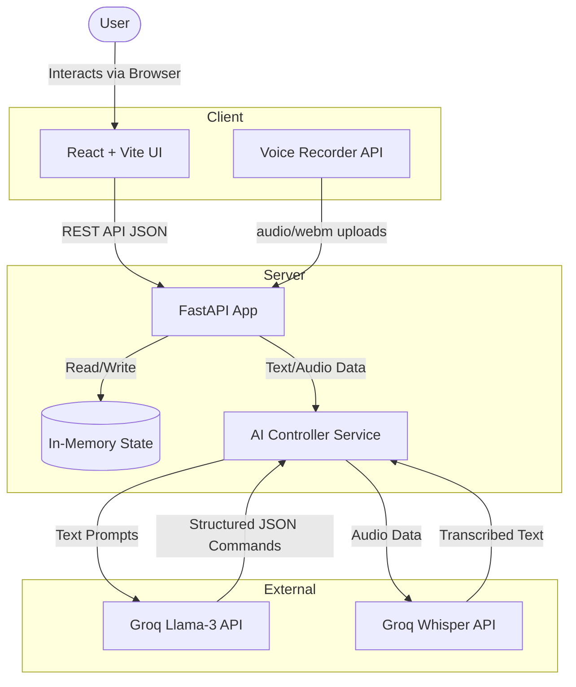

# SmartHome AI 🏠

An intelligent home automation system powered by AI, featuring a fully decoupled architecture with a modern React frontend and a fast Python backend.

## Features

- 🤖 **AI-Powered Control**: Uses Groq API for intelligent home automation decisions
- 🎤 **Voice Recognition**: Seamless speech-to-text integration via Groq's Whisper model (handles `.webm` directly from the browser)
- 🎨 **Premium UI**: Beautiful, responsive dashboard built with React, Vite, and Vanilla CSS glassmorphism
- ⚡ **Robust Backend**: Fast, type-safe API built with FastAPI and Pydantic
- 📱 **Easy to Use**: Intuitive controls, quick scenes, and real-time device tracking

## System Architecture



## Requirements

- Python 3.8+
- Node.js & npm
- Groq API key

## Installation

1. Clone the repository:
```bash
git clone https://github.com/NischithGowdaR/ai_home_automation_system.git
cd ai_home_automation_system
```

2. Set up your environment:
Create a `.env` file in the root directory with your Groq API key:
```env
Groq_API_Key=your_api_key_here
```

3. Install Backend Dependencies:
```bash
cd backend
pip install -r requirements.txt
cd ..
```

4. Install Frontend Dependencies:
```bash
cd frontend
npm install
cd ..
```

## Usage

To run the application, you'll need two terminal windows:

**Terminal 1 (Backend)**:
```bash
cd backend
uvicorn main:app --reload
```
*The API will start at `http://127.0.0.1:8000`*

**Terminal 2 (Frontend)**:
```bash
cd frontend
npm run dev
```
*The web app will be available at `http://localhost:5173`*

## Project Structure

```
ai_home_automation_system/
├── backend/            # Python FastAPI application
│   ├── main.py         # API endpoints
│   ├── models.py       # Pydantic data models
│   ├── state.py        # In-memory device state
│   ├── ai_service.py   # Groq LLM and Whisper integration
│   └── requirements.txt
├── frontend/           # React + Vite application
│   ├── src/            # UI components and styles
│   └── package.json
├── .env                # Environment variables (not tracked)
├── .gitignore          # Git ignore rules
└── README.md           # This file
```

## Technologies Used

- **Frontend**: React, Vite, Lucide-React, CSS Glassmorphism
- **Backend**: FastAPI, Uvicorn, Python, Pydantic
- **AI Services**: Groq API (Llama-3 & Whisper)

## License

MIT License - Feel free to use this project for your own purposes.

## Contributing

Contributions are welcome! Feel free to submit issues and enhancement requests.
